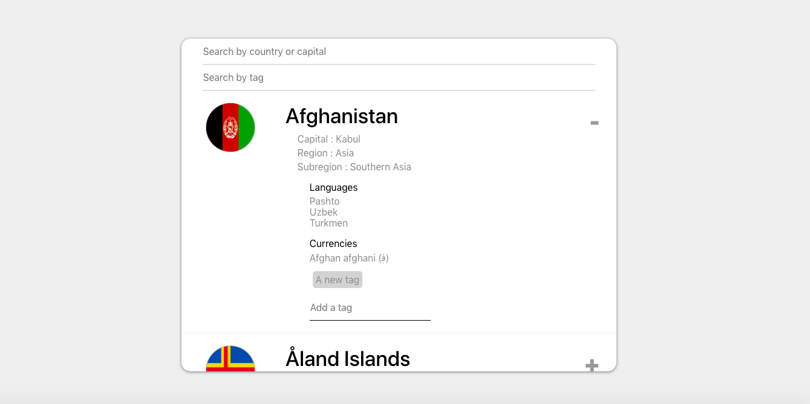

# Countries-React

#### An application used to get informations about countries via a RESTful API, filter by country name or capital. Tags can be added by the user for each country and the user can filter the data by tag as well. Built with React, JavaScript, and CSS.

### Installation and Setup Instructions
Clone down this repository. You will need node and npm installed globally on your machine.

## Installation:

npm install

## To Run Test Suite:

npm test

## To Start Server:

npm start

## To Visit App:

localhost:3000/ideas
